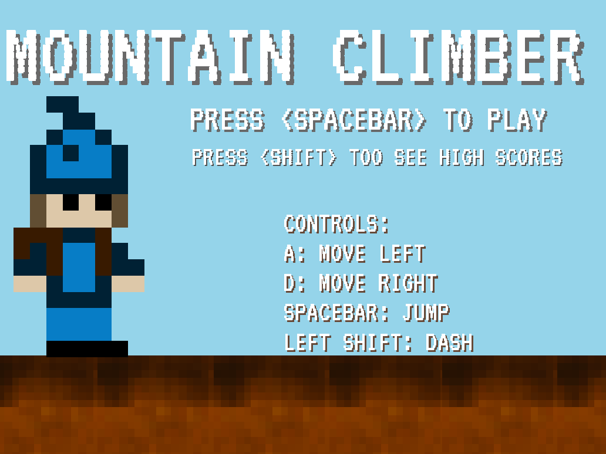
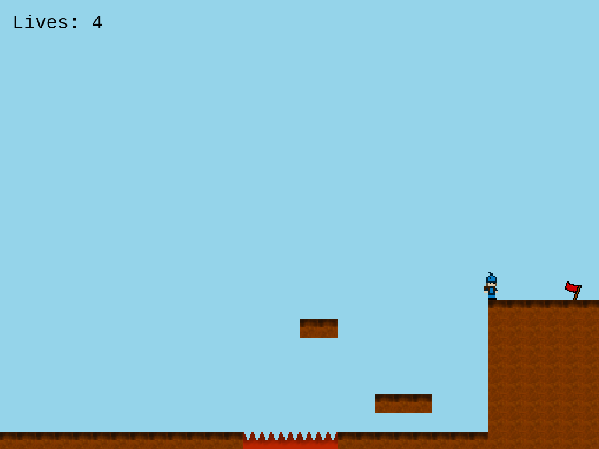
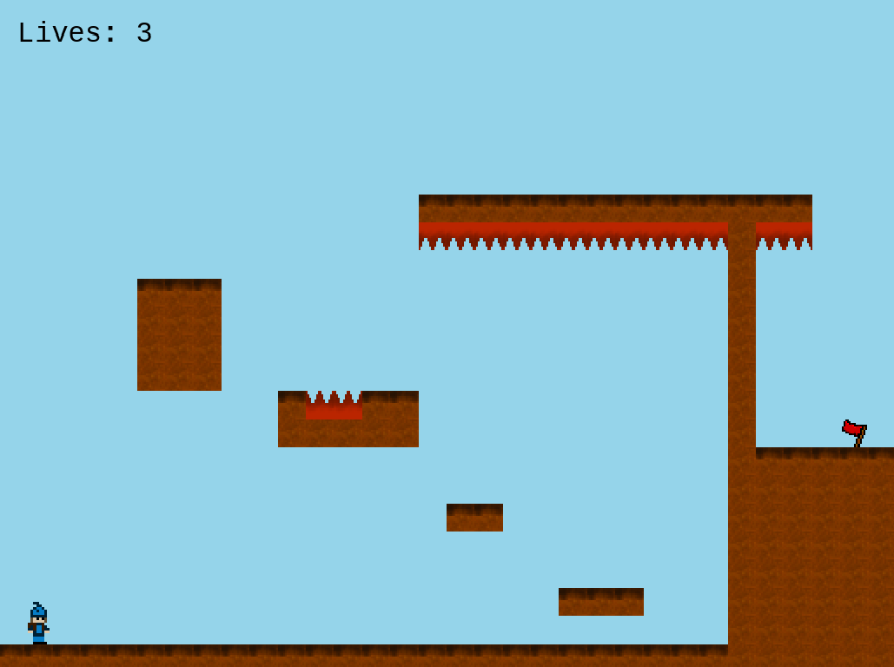

# Mountain Climber

## The Game
Mountain Climber is a platforming game inspired by the 80s games of this genre and some modern games such as Celeste.
The score is determined by the number of levels the player completed. Each level is completed by reaching the goal flag. There are only five levels. Each time the player completes all five levels, the difficulty will increase by adding more enemies and eventually making them faster.
I added the ability to save the players scores and showcase the 6 highest scores.

## Design process
Mountain Climber was created as part of the Microverse curriculum, as the final JavaScript project. It's a 5 day assignment and I was assigned a platform game. After investigating about Phaser 3 and it's tools, I decided to make my code as generic as possible to facilitate the level design. Each platform is a collection of 'tiles', which are 32x32 squares. To save me some time calculating coordinates, I divided the playing field in a grid and made a function to calculate the tiles position. I used graph paper to design my levels first and then I added the tiles in the canvas in my code.

For the player movement, I tried to make the game as comfortable to play as possible. It's possible to play the game with just the left hand. Due to time constraints, I left the right hand control and two hands control as a side project for after submission, as well as the option to change the player input.

After designing five levels, I felt the game was still too easy so I added some enemies and decided to add more the more levels were cleared. That made a good challenge after a couple of playing cycles.
I hope you enjoy my game!

## Built With

- JavaScript
- Phaser 3
- Webpack

## Live Version

You can play Mountain Climber [here](http://mountain-climber.herokuapp.com/)

## Screenshots 



## Getting Started

To get a local copy of my game, follow these steps:

- Clone the repository or download it as a .zip and extract it
- Open a terminal and change the directory until you are in the project's folder
- Run the following command on the terminal
> ``` npm install ```
- You will then need to start a local webserver, so run the following command
> ``` npm start ```
- The project opens a local webserver with that command, so you can play the game on your browser by opening http://localhost:8080/ on your browser

## Acknowledgements

### Background Music
  - Author: [Erhling]((https://soundcloud.com/ehrling)) - You can find his soundcloud [here](https://soundcloud.com/ehrling)
  - Track 1: [Adventure](https://soundcloud.com/ehrling/ehrling-adventure)
  - Track 2: [Sax Education](https://soundcloud.com/ehrling/sax-education-1)
  - Track 3: [Typhoon](https://soundcloud.com/ehrling/ehrling-typhoon)

### Phaser 3
  - Author: [photonstorm](https://github.com/photonstorm)
  - You can find Phaser's repository [here](https://github.com/photonstorm/phaser)

### Sprites and Tiles
  - Author: [Miguel Dubois](https://github.com/MiguelDP4) - That's me.
